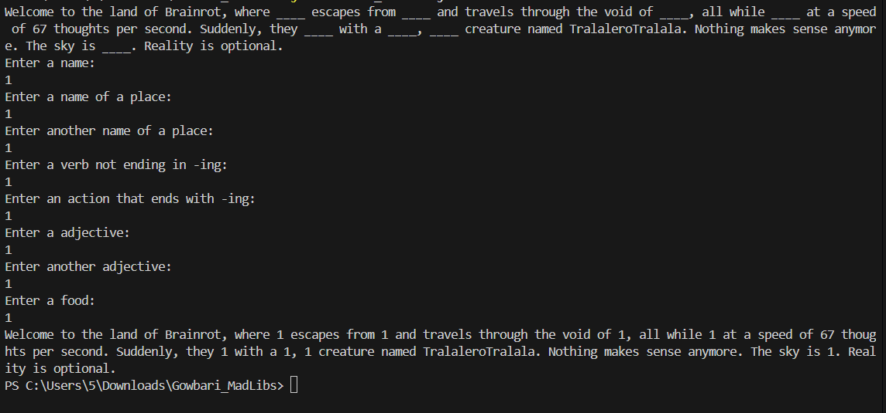
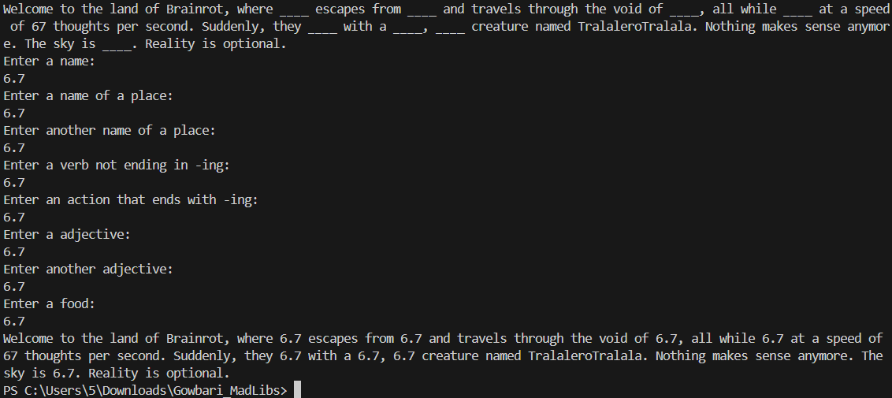

# Gowbari_MadLibs
# Our Approach 
### Created a basic outline story that interested us, then used scanner import to store user inputs into variables. Then used concatenation techniques to display the final story output with the variables saved from the scanner  input function. We hope you enjoy the brainrot story!
# MadLibs Milestones
## Create the MadLibs riddles
- Estimated time: 15 minutes
- Actual Time: 10 minutes

## Find Speech to Replace
- Estimated Time: 10 minutes
- Actual Time: 5 minutes

## Show each part of speech to the user
- Estimated Time: 6 minutes
- Actual Time: 7 minutes

## Get the user’s response
- Estimated Time: 10 minutes
- Actual: 15 minutes

## Get the user’s response Cell
- Estimated Time: 10 munutes
- Actual Time: 12 minutes

# Output Screenshot

### Test 1 w/ Integer 

### Test Case 2 w/ Double

